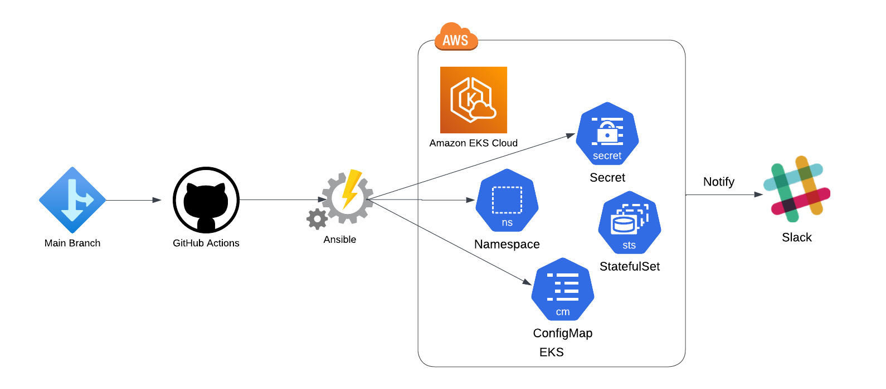

# Redis StatefulSet Deployment with GitHub Actions

This repository orchestrates the deployment of a Redis StatefulSet on Kubernetes, leveraging the automation capabilities of GitHub Actions.



## Overview

The setup includes Ansible roles for configuring Kubernetes resources and a playbook for deploying a Redis cluster as a StatefulSet. The GitHub Actions pipeline facilitates continuous deployment upon commits to the main branch.

## Structure

- `configmap`: Defines Redis configurations.
- `namespace`: Manages the Kubernetes namespace.
- `secrets`: Handles Kubernetes secrets for Redis credentials.
- `stateful_app`: Deploys the Redis StatefulSet, Service, and associated PersistentVolumeClaims.

The `playbook.yml` coordinates these roles for a streamlined deployment process.

## Getting Started

1. Clone this repository: `git clone git@github.com:nullobsidian/redis-eks-automation.git`

2. Enter the repository directory: `cd redis-eks-automation/`

3. Modify the `playbook.yml` as per your requirements.

4. Commit your changes:

```shell
git add .
git commit -m "Configure deployment"
git push origin main
```

5. GitHub Actions will pick up the changes and start the deployment process.

## GitHub Actions Workflow

The workflow within `.github/workflows/main.yml` initiates the following actions:

- Environment setup.
- Dependency installations.
- Execution of `ansible-playbook` with `playbook.yml`.

## Role Details

Each role is equipped with tasks and variables that are detailed in their respective `tasks/main.yml` files:

- `configmap`: Configures the Redis instance via a ConfigMap.
- `namespace`: Ensures the Kubernetes namespace for Redis is present.
- `secrets`: Securely manages Redis secrets.
- `stateful_app`: Deploys the Redis StatefulSet with the necessary configurations.

Please consult the README within each role's directory for further information.

## Support

For issues or assistance, raise an issue within this GitHub repository.

---

*Note*: The default configuration uses Redis image `7.2.3`, with a single replica and `10Gi` of storage. Modify these settings based on your environment's needs.

